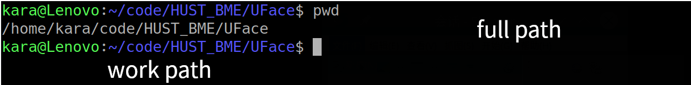
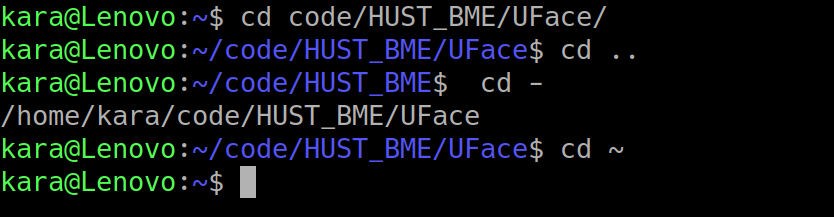
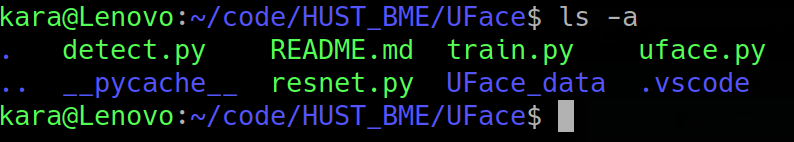

# Ubuntu Useful commands
This file will introduce some ubuntu basci concept
## 文件结构
ubuntu是单根目录结构，所有目录均从根目录"/"开始，没有win盘符的概念。
常见目录功能如下  
1. / :根目录，该目录下包含Linux文件系统下所有文件  
2. /home/ : 用于目录，比如/home/kara/,就是kara用户的目录  
3. /etc/ :配置文件目录，无需了解  

Ps:1.linux 下目录分割符是 / 

## 常用命令
**1 使用 命令 -h ,或者 man 命令，或者 命令 --help**

**2 ./ : 代表当前目录  ， ../ : 代表上级目录**
#### 目录切换
1. cd /home 进入 '/ home' 目录' 
2. cd .. 返回上一级目录 
3. cd ../.. 返回上两级目录 
4. cd ~user 进入个人的主目录 
5. cd - 返回上次所在的目录 

#### 显示路径
1. pwd 显示工作路径 

#### 查看文件
1. ls 查看目录中的文件 
2. ls -l 显示文件和目录的详细资料 
3. ls -a 显示所有文件 

#### 编辑文件
1. 使用vim编辑器或者vi
2. 使用nano

#### 创建文件
1. mkdir dir1 创建一个叫做 'dir1' 的目录
2. mkdir -p /tmp/dir1/dir2 创建一个目录树 
3. vi name.type 编辑该文件，若不存在，创建并编辑
4. touch name.type 创建一个文件

#### 删除文件(不可恢复)
1. rm file1 删除一个叫做 'file1' 的文件' 
2. rmdir dir1 删除一个叫做 'dir1' 的目录' 
3. rm -r dir1 删除一个叫做 'dir1' 的目录并同时删除其内容 

#### 移动重命名文件
1. mv dir1 new_dir 重命名/移动 一个目录 

#### 复制文件
1. cp file1 file2 复制一个文件 

#### 系统信息查看
1. free : 查看内存使用状态
2. top : 产看进程信息
3. kill : 结束某一个进程

#### 高级用法
1. 通配符
2. 管道
3. 重定向
4. ...
**Ps: 较为复杂，但是很高效**

#### 管理员
1. apt : 更新，安装，卸载软件
2. dpkg -i *.deb :安装一个deb包(* 是通配符，可是任意字符）
3. sudo command : 用管理员权限运行

#### tricks
1. 使用Tab可以补全命令，路径等
2. ... 
